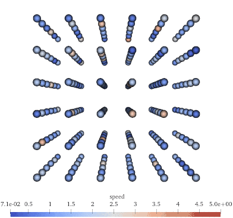
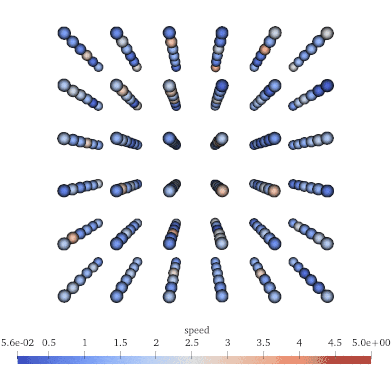

# Molecular Dynamics Simulation

[](https://travis-ci.com/GNikit/md-sim)

A program simulating Molecular Dynamics (MD) fluids, with the option to use
custom pair potentials, with a range of initial lattice and boundary conditions.

<!-- ## Description

A program written to investigate the transition of a fluid from MD to SPH.
The C++ files **MD.cpp** and **MD.h** contain the core of the fluid simulation
while **tools/md-tools** contains some analysis methods written in Python.
The file **bin/md** executable in combination with the schema under **schemas**
can be used to simulate a fluid with any initial parameters,
by simply changing the xml file passed to **md**, like so:

```sh
./bin/md input_options.xml
```

Examples where the MD class is used as part of a C++ file can be found under
**examples** -->

## Features

* Multiple pair potentials (easily extensible):
  * Bounded Inverse Power (BIP)
  * Gaussian Core Model (GCM)
  * Exponential Pair Potential (EXP)
  * Lennard-Jones Pair Potential (LJ)
* Multiple options for boundary conditions:
  * Periodic
  * Reflective
* Multiple initial lattice starting positions:
  * Simple Cubic (SC)
  * Face Centred Cubic (FCC)
  * Body Centred Cubic (BCC)
  * Random, based on normal distributions
* Multiple choices for iterative algorithms:
  * Explicit Verlet
  * Velocity Verlet
  * Runge Kutta 4th Order
* Statistical quantities calculation:
  * Mean Square Displacement (MSD)
  * Velocity Autocorrelation Function (VAF)
  * Radial Distribution Function (RDF)
  * Structure Factor (SFx, SFy, SFz)
* 3D visualisation output through ParaView and CSV formatted logs
* Fluid compression for phase transitions
* Easy to use UI interface for setting up options
* Unit and regression testing

## Getting Started

### Clone

You can clone the project with all its submodules with:

```bash
git clone --recurse-submodules https://github.com/GNikit/md-sim.git
```

### Build

Build the library and the **md** executable:

```bash
make -j
```

### Testing

To run the test regression tests run:

```bash
make test
```

To add tests look into the tests folder.

## Running a simulation

The preferred way for passing in options for a run is through the use of a .xml
file. Such .xml files can be found in the **tests** directory or made from
scratch using diamond (more on that later)<!-- todo: add hyperlink to later section -->

The following will run a simulation using an .xml input

```bash
./bin/md schemas/input_schema.xml
```

However, `libmd` can still by manually passing arguments as seen from the two
examples below.
Code without the use of the xml parser can be found in the **examples** directory.

## Use libmd in your C++ project

A minimal working example of how to use the `libmd.a` is shown below, make sure
to link and include the static library and the header file **MD.h** to your program.

```C++
#include "MD.h"

int main() {
  options_type options;

  options.steps = 5000;                     // number of iterations
  options.density = 0.5;                    // fluid density
  options.target_temperature = 0.5;         // fluid thermostat temperature
  options.potential_type = "LennardJones";  // pair potential type
  options.particles = {10, 10, 10};         // number of particles in xyz
  // More fine tuning options are available see data_structures.h

  MD run(options);
  run.Simulation();
}
```

Alternatively, one can use the non-options data structures for initialising MD

```C++
#include "MD.h"

int main() {
  size_t steps = 5000;  // number of iterations
  double rho = 0.5;     // fluid density
  double t = 0.5;       // fluid temperature

  MD run(steps, {10, 10, 10}, "SimpleCubic");
  run.Simulation("demo_", rho, t, NAN, NAN, "LennardJones");
}
```

## Visualise using ParaView

<!-- Use https://ezgif.com to compress and resize the .gif -->

To enable visualisation of the particles set the `io/track_particles` option
to `true` in the schema, or directly set `options.io_options.visualise = true`
before running a simulation.

Then load the *xzy_data_...csv* into [ParaView](https://www.paraview.org/),
select *Table of Points* from the available filters, set x, y and z positions.
For a nicer view, change the default representation *Surface* to
*Point Gaussian* and increase the *Gaussian Radius*.
A full set of instructions on how to load CSV files to Paraview can be found
[here](https://www.paraview.org/Wiki/ParaView/Data_formats).

| *Periodic Boundary conditions for a Lennard-Jones fluid* | *Reflective Boundary conditions for a Lennard-Jones fluid* |
| -------------------------------------------------------- | ---------------------------------------------------------- |
|       |      |

## Visualising log files

The log files produced from a run (if io options have been enabled) contain a
range of statistical quantities indicative of how the fluid develops over time.
The files are in CSV format, so almost any plotting tool can be used to
visualise their values. A Python submodule in included under *tools/md-tools*
that uses `numpy` and `matplotlib`, but the code is far from complete or robust.

## Using diamond and libspud

This project relies on [spud](https://github.com/fluidityproject/spud) to
easily read and set options from input files. Spud offers a visualisation tool
called `diamond` to view the input options using a GUI.
By default calling `make` on the top directory of `md-sim` compiles
`libspud` and installs `diamond` and its helper functions in `bin`.

Use the following command to launch the GUI against a `test_file.xml`

``` bash
./bin/diamond -s schemas/main_schema.rng test_file.xml
```


For more information about the diamond GUI see `spud/doc/spud_manual.pdf`

## Updating the schema

If the schema files (rnc) are modified the rng files need to updated too.
This can be done be calling:

```bash
make schema
```
